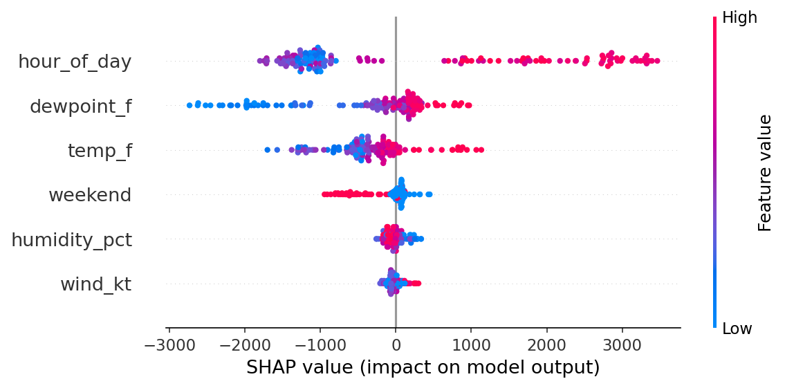

# Lab 2 report - explaining our demand model

Authors: Manshi Patel (Partner A), Davide Trani (Partner B)
<!-- ^ You and your partner BOTH edit THIS ONE LINE with your name, each on your own branch.
     When the second pull request merges you'll get a merge conflict right here - that's on
     purpose. Resolve it by keeping BOTH names. Everything else below is in separate sections,
     so those merge cleanly. -->

*Two people, one model, two kinds of explanation. Fill in YOUR section; leave your partner's alone.
Replace every `=>` with a real sentence; every number gets a unit.*

## Global - what the model leans on overall (Partner A)

=> One sentence: which feature does the model lean on most, by magnitude alone?

=> One sentence: which feature is #1, and does a HIGH value push demand up or down?

## Local - one hour explained (Partner B)

The points mostly follow the diagonal (R² = 0.83 on the test hours), and a typical hour is off by about 662 MW.

On Aug 18, 2026 at 17:00 the model predicted more than the actual demand (19,386 MW vs 18,585 MW). The biggest push up was hour_of_day (+2,858 MW), then temp_f at 85 °F (+1,133 MW), while the blue features, dewpoint_f and wind_kt, had only a small effect (−30 MW and −7 MW).

## Combined (both, optional)

=> One sentence tying Lab 1 to Lab 2: *"it's the clock as much as the thermometer"* - in your words.

## What this explanation can't tell us
SHAP explains this model, not the real world: it shows the pattern the model leaned on (one summer, one region), not proof of cause.
